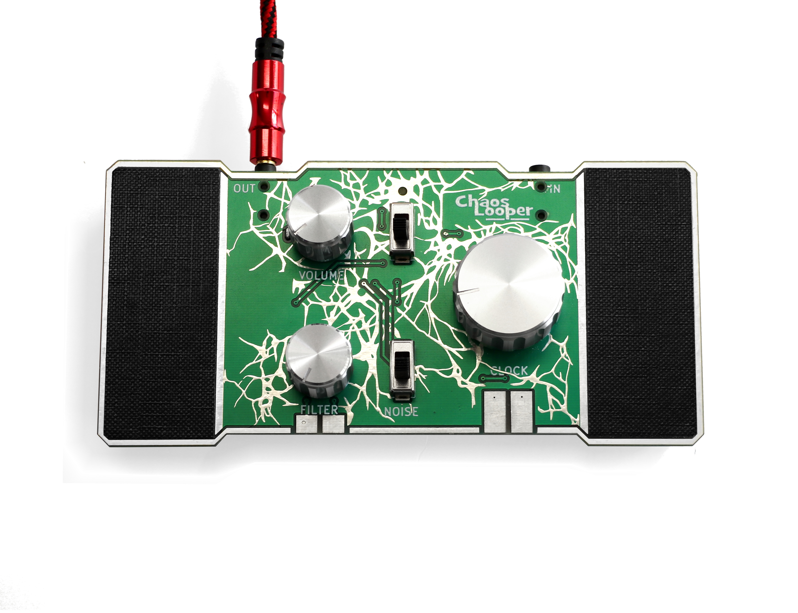
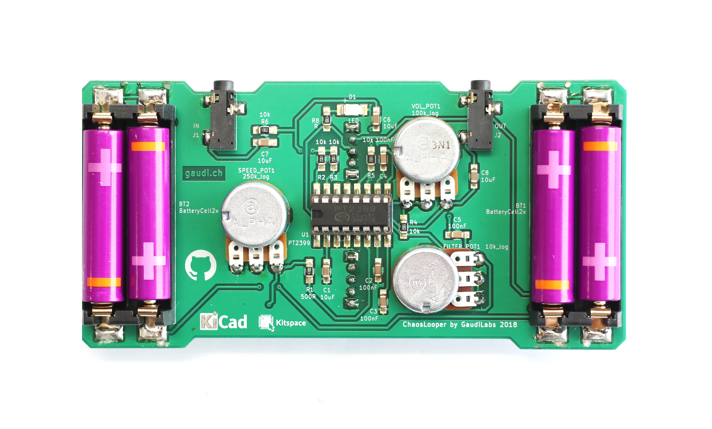

# Tha ChaosLooper Noise Synthesizer

 - [Buy the kit](https://gaudishop.ch/index.php/product/chaoslooper/)
 - [Kitspace page](https://kitspace.org/boards/github.com/gaudilabs/chaoslooper/)

Introducing the ChaosLooper noise synthesizer. Built based on the popular digital loop chip PT2399 the circuit produces diverse looping noise by amplifying the charges of the on-chip memory. The speed of the loop can be varied from slow noise floor to fast beats. A built in filter and noise switch modify the sounds. The line in can be used to seed the chaos.

I built this instrument many years ago and it became one of my favorite synths. I played it in HackteriaLab Romainmôtier, at the Rural Hub in Naples, with LifePatch in Yogyakarta and at Gaîté Lyrique in Paris and every time I was surprised about the intensity and the spectrum of its noise. When ever I play it I discover some new sounds and ways to play it. Its a synth of its very own kind.

The optional bottom case is available [here as a download](https://www.thingiverse.com/thing:999999) for do it your self 3D printing.

Warning: This is not a traditional looper. Its a noise machine. Big powerful amplifier stage recommended.

Tip: Play two of them together or feed one into another for extra fun.

<iframe width="560" height="315" src="https://www.youtube.com/embed/4cwsQAyd_mE" frameborder="0" allow="accelerometer; autoplay; encrypted-media; gyroscope; picture-in-picture" allowfullscreen></iframe>
